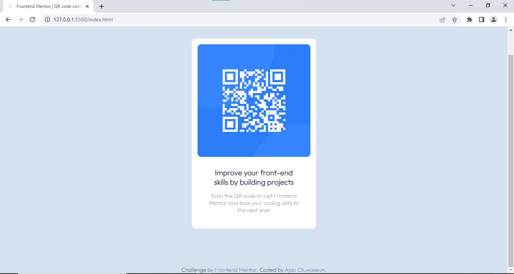

# Frontend Mentor - Results summary component solution

This is a solution to the [Results summary component challenge on Frontend Mentor](https://www.frontendmentor.io/challenges/qr-code-component-iux_sIO_H). Frontend Mentor challenges help you improve your coding skills by building realistic projects. 

## Table of contents

- [Overview](#overview)
  - [The challenge](#the-challenge)
  - [Screenshot](#screenshot)
  - [Links](#links)
- [My process](#my-process)
  - [Built with](#built-with)
- [Author](#author)

## Overview

### The challenge

Users should be able to:

- View the optimal layout for the interface depending on their device's screen size
- See hover and focus states for all interactive elements on the page

### Screenshot

### Links

- [Repo URL](https://github.com/Ajayfrizzy/qr-code-component.git)
- [Live site URL](https://ajayfrizzy.github.io/qr-code-component/)

## My process

### Built with

- Semantic HTML5 markup
- Mobile-first workflow
- Google Font

## Author

- Frontend Mentor - [@Ajayfrizzy](https://www.frontendmentor.io/profile/Ajayfrizzy)
- Twitter - [@Ajayfrizzy](https://www.twitter.com/Ajayfrizzy)